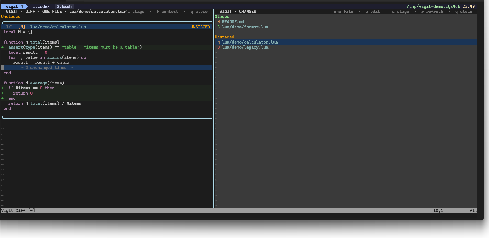

<div align="center">

# Vigit

**Review AI-agent changes across Git worktrees without leaving Neovim.**

A keyboard-first Git workspace for inspecting, correcting, and handing review
comments back to coding agents.

[Live site](https://vigit-neovim.gentostage.chatgpt.site) · [Quick demo](#quick-demo) · [Installation](#installation) · [Key mappings](#key-mappings)

</div>



## Why Vigit

- Keep staged and unstaged changes clearly separated.
- Switch between a compact file list and a VS Code-style collapsed tree.
- Review every changed file in one scrollable view or focus on a single file.
- Stage or unstage a whole file or the hunk under the cursor.
- Reuse installed TreeSitter parsers for syntax-aware diff highlighting, with
  compact gutter change bars and a built-in Lua fallback for the isolated demo.
- Open the real file in a normal, editable Neovim tab and return to a refreshed
  diff.
- Preview a different file simply by moving through the changes panel in
  one-file mode.
- Switch between task worktrees from a modal view with branch and change
  counters.
- Attach local multi-line comments to exact diff ranges and see their markers
  next to Git changes.
- Browse, edit, delete, and hand all comments to Codex through one generated
  `comments.md` file without terminal or tmux automation.

## Status

Vigit is an early MVP for hands-on evaluation. File and hunk staging,
unstaging, tree navigation, one-file preview, editing, local comments, and
untracked files are implemented. Commit, branch, push, pull, log, and
side-by-side diff interfaces are not available yet.

## Quick demo

```bash
git clone git@github.com:Gentostage/vigit.git
cd vigit
./scripts/demo.sh
```

The script creates a temporary Git repository plus a linked `demo-secondary`
worktree. Together they contain independent staged, unstaged, untracked,
nested, deleted, and long-file changes. The linked worktree also contains a
local comment attached to its README diff. It launches Vigit in a clean
Neovim session; press `w` to open the picker, where `ROOT` marks the primary
checkout and `WT` marks linked worktrees. The complete fixture is removed when
Neovim exits.

Use your own Neovim configuration:

```bash
./scripts/demo.sh --user-config
```

Try the isolated Telescope integration:

```bash
./scripts/demo.sh --plugins
```

The plugin demo requires Neovim and Git. The `--plugins` mode requires Neovim
0.12+, installs Telescope v0.2.1 and plenary.nvim into the isolated
`vigit-demo` package namespace, and does not modify `~/.config/nvim`.

## Installation

### lazy.nvim

```lua
{
  "Gentostage/vigit",
  config = function()
    require("vigit").setup()
  end,
}
```

### Manual

Clone Vigit somewhere on your machine, append it to `runtimepath`, and call
`setup()`:

```lua
vim.opt.runtimepath:append(vim.fn.expand("~/path/to/vigit"))
require("vigit").setup()
```

## Setup

Open any Git worktree in Neovim and run:

```vim
:Vigit
```

## Workflow

```text
All changes  ── Enter ──>  One-file diff  ── e ──>  Normal edit tab
     ▲                           │                        │
     └──────────── a ────────────┴────────── Q ──────────┘
```

The edit tab uses an ordinary modifiable file buffer. Filetype detection,
syntax highlighting, LSP, user mappings, and installed plugins keep working.
After `:w`, press `Q` to return to an updated Vigit view. If any file in the
edit workspace is still modified, Vigit blocks the return and lists the files
that must be saved or explicitly discarded.

## Key mappings

| Key | Action |
| --- | --- |
| `t` | Toggle compact `LIST` and collapsed `TREE` |
| `<CR>` | Focus the selected file; collapse or expand a tree directory |
| `h` / `l` | Collapse or expand the directory under the cursor |
| `a` | Return to the all-files diff |
| `e` | Edit the selected file in a normal Neovim tab |
| `gd` | Open the real file at the cursor and request its LSP definition |
| `w` | Open the worktree picker |
| `[w` / `]w` | Move between open Vigit worktree tabs |
| `c` | Add a comment, or edit the comment marked on the current diff line |
| visual `c` | Attach a comment to the selected range in one diff file |
| `P` | Copy/open a Codex prompt for the current comments |
| `C` | Open the comment list |
| `s` | Stage an unstaged file/hunk or unstage a staged file/hunk |
| `r` | Refresh Git status and diff |
| `f` | Toggle compact and expanded diff context |
| `q` | Close the Vigit interface |
| `Q` | Return from the edit tab to Vigit |
| `:qa!` | Exit Neovim completely |

## Comment workflow

Press `c` on a changed line to write one ordinary multi-line comment. Use
visual `c` to comment on a range inside one file. Save with `:w` or `Ctrl-S`.
Vigit immediately stores it outside the working tree and shows its ID plus a
short preview, such as `● VIGIT-001 · Clarify this condition…`, next to the
anchored diff line. Press `c` on that line again to edit the comment directly.
When several comments share an anchor, select the one to edit from the popup.

Press `C` for the complete list:

| Key | Action |
| --- | --- |
| `<CR>` | Close the list and jump to the comment source in one-file diff |
| `e` | Edit the selected comment |
| `d` | Delete it after confirmation |
| `r` | Refresh comments and Git state |
| `q` | Close the list |

Structured JSON remains the internal source for editing. After every
create/edit/delete, Vigit also rebuilds one agent-friendly file:

```text
<git-common-dir>/vigit/worktrees/<worktree-id>/
  comments.md
```

Press `P` to copy a short Codex prompt containing the absolute `comments.md`
path and exact worktree root. When a clipboard provider is unavailable, Vigit
opens the prompt in a read-only window where `y` copies it.

Optionally install the bundled Codex skill:

```vim
:VigitInstallCodexSkill
```

Use `:VigitInstallCodexSkill!` to replace an older version after confirmation.
The skill reads `comments.md`, applies focused changes in the exact worktree,
and reports resolved or blocked IDs. It does not edit the comment file, stage,
commit, push, or inspect another worktree. Review the resulting diff and delete
completed comments manually.

Use `:VigitWorktrees` or `w` to open the worktree modal. Selecting a worktree
focuses its existing Vigit tab or opens a new tab with a tab-local working
directory. Inside the modal, `d` removes a linked `WT` after typing `DELETE`;
the primary `ROOT` cannot be removed, open Vigit worktrees must be closed
first, and the Git branch is always kept.

## Plugin-friendly edit mode

Inside the edit workspace, use normal Neovim navigation:

```vim
:edit path/to/file
:find filename
gf
:vimgrep /text/gj **/* | copen
```

With `./scripts/demo.sh --plugins`, Telescope mappings are available:

| Key | Action |
| --- | --- |
| `<leader>ff` | Find files |
| `<leader>fg` | Live grep |
| `<leader>fb` | Open buffers |

Every regular file buffer opened in the edit tab is attached to the Vigit
workspace, so `Q` remains available after navigating to another file.

Vigit automatically uses TreeSitter parsers already installed in Neovim. For
example, install Python highlighting with:

```vim
:TSInstall python
```

Collapsed context lines also show their enclosing class and function when the
active parser can identify them.

`gd` uses Neovim's standard LSP client after opening the real source buffer.
Vigit does not install a language server; the server configured for that
filetype attaches exactly as it does during normal editing.

## Project site

The [live project card](https://vigit-neovim.gentostage.chatgpt.site) is built
from [`public/site/`](public/site/index.html). It remains plain HTML and CSS;
the repository root only adds the Vinext hosting wrapper required by Sites.
The page shares the repository screenshots and is ready for a real WebM or MP4
demo recording.

## Roadmap

- Commit and branch workflows.
- Push, pull, and log views.
- Side-by-side diff mode.
- Configurable mappings and layout.
- Automatic stale-comment re-anchoring.
- Recorded demo and richer project gallery.
