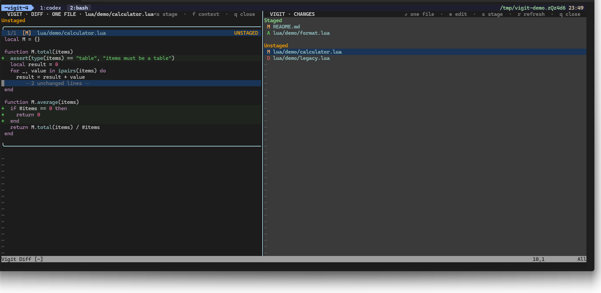

<div align="center">

# Vigit

**Review AI-agent changes across Git worktrees without leaving Neovim.**

A keyboard-first workspace for inspecting diffs, correcting code, leaving
anchored comments, and handing precise feedback back to a coding agent.

[Website](https://gentostage.github.io/vigit/) · [Quick demo](#quick-demo) · [Installation](#installation) · [Keymaps](#essential-keymaps)

</div>



## Why Vigit

AI agents can change many files across several worktrees. Vigit keeps that work
reviewable inside one familiar Neovim environment:

- staged and unstaged changes in a compact list or collapsible tree;
- all-files and one-file diffs with TreeSitter syntax highlighting;
- file-level and hunk-level stage/unstage actions;
- safe hunk or file restoration with `y/N` confirmation and stale-state checks;
- an independent review session for every canonical Git worktree;
- normal source buffers and terminal splits with your existing LSP, mappings,
  jumplist, Telescope, and plugins;
- tracked `.vigit/comments.md` feedback with stable anchors and agent replies;
- a worktree picker with dirty, ahead, behind, and no-upstream state;
- built-in contextual help and diagnostics with no required runtime plugins.

The core loop is deliberately small:

```text
inspect -> correct -> comment -> handoff
```

Vigit is an early MVP. Commit, branch, push/pull, log view, and side-by-side
diffs are not implemented yet.

## Requirements

- Neovim 0.10+
- Git 2.36+
- the Lua 5.1/LuaJIT runtime bundled with Neovim

Third-party runtime dependencies are optional. When TreeSitter parsers and
queries are already installed, Vigit reuses them for diff syntax highlighting.

## Installation

### lazy.nvim

```lua
{
  "Gentostage/vigit",
  config = function()
    require("vigit").setup()
  end,
}
```

### Manual installation

```lua
vim.opt.runtimepath:append(vim.fn.expand("~/path/to/vigit"))
require("vigit").setup()
```

Open any path inside a Git worktree and run:

```vim
:Vigit
```

Available commands:

| Command | Purpose |
| --- | --- |
| `:Vigit [path]` | Open or restore the review workspace |
| `:VigitWorktrees` | Open the worktree picker from any normal Neovim buffer |
| `:VigitComments` | Open comments for the active worktree |
| `:VigitHelp` | Open contextual help |
| `:VigitLog` | Open Vigit diagnostics |
| `:VigitMigrateReviews` | Explicitly import legacy review data |
| `:VigitInstallCodexSkill[!]` | Install or replace the bundled Codex skill |

`:VigitV2` remains a temporary compatibility alias for `:Vigit`.

To make the worktree picker available on `W` outside Vigit, add an optional
global mapping to your Neovim config:

```lua
vim.keymap.set("n", "W", function()
  require("lazy").load({ plugins = { "vigit" } })
  vim.cmd("VigitWorktrees")
end, { desc = "Vigit worktrees" })
```

This replaces Vim's native `W` motion in normal mode.

## Workspace and worktree model

Vigit uses the current native tab as a workspace and renders review UI as two
floating windows over the normal editor layout. Every canonical worktree keeps
an independent session, but only one session is visible and marked `ACTIVE` at
a time. Switching worktrees does not create more Neovim tabs.

`e`, `gd`, and `T` hand control back to user-owned buffers:

- `e` opens the selected source file in the current editor workspace;
- `gd` opens the source position and invokes the standard LSP definition;
- `T` opens a terminal split rooted in the active worktree.

Vigit does not add its own mappings, options, winbar, or lifecycle autocmds to
source and terminal buffers. Run `:Vigit` to restore the review at its previous
diff anchor. Press `q` inside Vigit to hide the review and return to code mode.

## Essential keymaps

| Key | Action |
| --- | --- |
| `<Tab>` | Switch focus between diff and changes |
| `<CR>` | Open the selected change |
| `]f` / `[f` | Next/previous file |
| `]h` / `[h` | Next/previous hunk |
| `a` | Toggle one-file/all-files diff |
| `t` | Toggle tree/list changes view |
| `f` | Expand/collapse full context |
| `e` | Open the source file |
| `gd` | Go to the LSP definition |
| `T` | Open a terminal in the worktree |
| `s` | Stage/unstage the current file |
| `S` | Stage/unstage the current hunk |
| `x` | Restore an unstaged hunk after `y/N` |
| `X` | Restore a file to `HEAD` after `y/N` |
| `c` | Add/edit a comment at the diff anchor |
| `C` | Open the comment list |
| `P` | Copy/show the prompt for open comments |
| `W` | Open the worktree picker |
| `r` | Refresh Git state |
| `?` | Open context-aware help |
| `q` | Hide Vigit and return to code mode |

The generated complete reference lives in [docs/keymaps.md](docs/keymaps.md).

## Comments and agent handoff

Each worktree stores one canonical tracked document:

```text
.vigit/comments.md
```

Every block contains a stable ID, source anchor, reviewer comment, an agent
reply section, and an open/completed checkbox.

1. Press `c` on a changed line and save the comment with `<C-s>`.
2. Press `C` to browse all comments, jump to their anchors, edit, or delete.
3. Press `P` to copy a prompt containing only open comments and the exact
   worktree root.
4. The agent updates the code or answers the question, records a concise result
   in the response section, and marks `[x]` only when complete.
5. Refresh with `r`, or save the source file, to reload markers and status.

Install the bundled Codex workflow with:

```vim
:VigitInstallCodexSkill
:VigitInstallCodexSkill!
```

The skill preserves unknown Markdown and comments owned by other reviewers. It
does not stage, commit, push, or remove worktrees without an explicit request.

## Safe worktree removal

Press `W` to open the picker. It distinguishes `ROOT` and linked `WT` entries
and shows branch, changed-file count, and upstream state. Network fetches are
never hidden; press `F` to fetch explicitly.

`d` removes only a linked worktree when all safety checks pass:

- Git status is clean;
- the branch has an upstream;
- `ahead == 0`;
- no loaded source buffer belongs to that worktree;
- the repeated preflight after `y` returns the same safe result.

Vigit removes only the inactive cached session, keeps the Git branch, and never
closes user-owned source buffers or terminal splits.

## Quick demo

```bash
git clone git@github.com:Gentostage/vigit.git
cd vigit
./scripts/demo.sh
```

The disposable fixture creates a root and four linked worktrees containing
staged and unstaged long files, mixed hunks, staged deletion, untracked files,
tracked open/completed comments, and safe, dirty, ahead, and no-upstream states.
Everything is removed after Neovim exits.

```bash
./scripts/demo.sh --user-config  # use your normal config and plugins
./scripts/demo.sh --plugins      # isolated Telescope + plenary integration
./scripts/demo.sh --check        # validate only the generated fixture
```

`--plugins` requires Neovim 0.12+, uses an isolated `NVIM_APPNAME`, and does
not modify your normal Neovim config.

## Development

Run the complete verification gate:

```bash
./scripts/test.sh
```

It runs unit tests, real-Git integration tests, headless Neovim workflows, and
the generated keymap drift check. The script stops on the first failure and
does not install dependencies or modify the user Neovim config.

## Project website

The static project page is served from [`public/site/`](public/site/index.html)
and deployed by GitHub Actions to
[gentostage.github.io/vigit](https://gentostage.github.io/vigit/).

For the first deployment, open **Repository Settings -> Pages** and select
**GitHub Actions** as the source. Every later push to `main` that changes the
repository will publish the current static page automatically.
